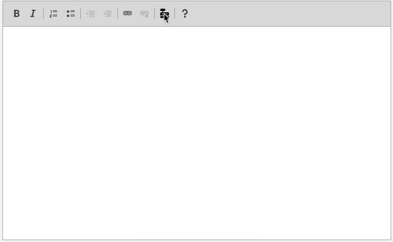

# CKEditor 4 Plugin - Cowriter 🤖

[](https://github.com/netresearch/ckeditor-cowriter/actions/workflows/release.yml)

This plugin generates content with the help of artificial intelligence. It is based on the [CKEditor 4](http://ckeditor.com/). It uses the [OpenAI API](https://beta.openai.com/) to generate text. You can use it to generate text for your blog posts, emails, or any other content.



> Give it a try and let the AI write for you: [Demo](https://netresearch.github.io/ckeditor-cowriter/)

## Installation

You can find the plugin in the [CKEditor plugin directory](https://ckeditor.com/cke4/addon/cowriter)

### Installation with [npm](https://www.npmjs.com/package/@netresearch/ckeditor-cowriter)

1. Install the plugin with npm:

    ```bash
    npm install @netresearch/ckeditor-cowriter --save
    ```

2. Enable the plugin by using the `extraPlugins` configuration setting. For example:

    ```javascript
    CKEDITOR.plugins.addExternal('cowriter', '/node_modules/@netresearch/ckeditor-cowriter/dist/', 'plugin.js')
    CKEDITOR.config.extraPlugins = 'cowriter';
    ```

### Installation from source

1. Download the [latest release](https://ckeditor.com/cke4/addon/cowriter) of the plugin.
2. Extract the contents of the archive into a directory. For example: `/plugins/cowriter/`
3. Enable the plugin by using the `addExternal`and  `extraPlugins` configuration setting. For example:

    ```javascript
    CKEDITOR.plugins.addExternal('cowriter', '/plugins/cowriter/', 'plugin.js')
    CKEDITOR.config.extraPlugins = 'cowriter';
    ```

## Configuration

You need to define your OpenAI credentials. Do this above the `CKEDITOR.replace` call. For example:

```javascript
const OPENAI_KEY = 'YOUR-KEY'
const OPENAI_ORG = 'org-YOUR-ORG-KEY'
```

## Usage

1. Click on the `Cowriter` button in the toolbar.
2. Enter a prompt.
3. Click on the `Generate` button.
4. The generated text will be inserted into the editor.

## License

Licensed under the terms of the [GNU General Public License](http://www.gnu.org/licenses/gpl.html), version 3 or later.

## Credits

- All Contributors
- This plugin is based on the [CKEditor 4 Plugin - GPT-3](https://github.com/netresearch/ckeditor-cowriter/releases) by [Netresearch](https://www.netresearch.de/).
- It uses Flaticon's [document](https://www.flaticon.com/) icon.

## Contributing

We welcome contributions to this project. Please see our [contribution guidelines](CONTRIBUTING.md) for details.

### Security

If you discover any security related issues, please email <developer@netresearch.de> instead of using the issue tracker!

### Contact

[Netresearch](https://www.netresearch.de/), the company behind this plugin, is a leading European provider of digital solutions and services for the eCommerce industry. We are a team of eCommerce experts, developers, designers, project managers, and consultants. We are passionate about eCommerce and we love to share our knowledge with the community.

> [Twitter](https://twitter.com/netresearch) | [LinkedIn](https://www.linkedin.com/company/netresearch/) | [Facebook](https://www.facebook.com/netresearch/) | [Xing](https://www.xing.com/companies/netresearchdttgmbh) | [YouTube](https://www.youtube.com/@netresearch)
